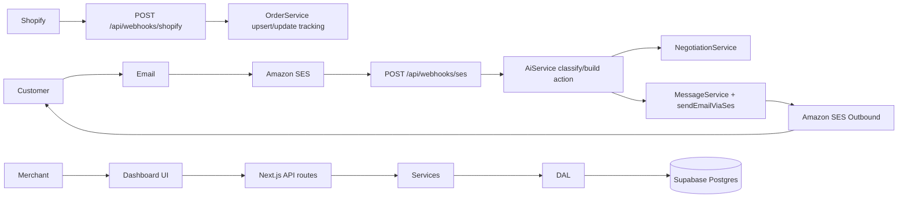
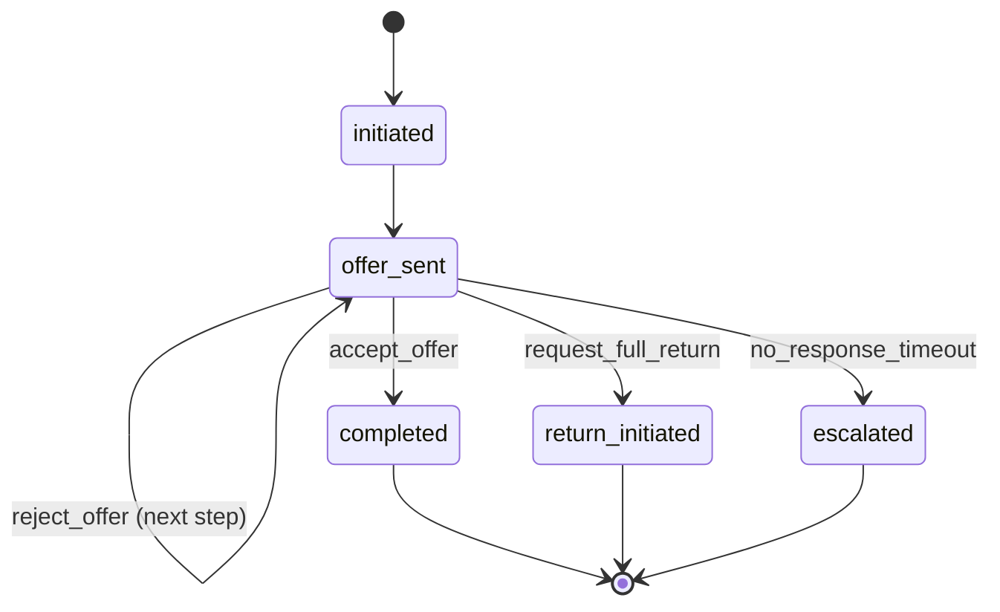

# Architecture

## System Flows

## Layered Architecture

- **Routes (`src/app/api`)**: validate input, resolve auth/session, call services, return `apiResponse/apiError`.
  - Example: `POST /api/inbox/conversations/[id]/reply` validates params/body, enforces ownership, calls `InboxService.sendReply`.
- **Services (`src/services`)**: business flows and orchestration across DAL + adapters.
  - Example: `WebhookService.handleSesInbound` does idempotency check, customer/conversation resolution, AI intent classification, optional negotiation, outbound send.
- **DAL (`src/dal`)**: table-specific data access and row mapping only.
  - Example: `OrdersDal` handles create/update/find queries for `orders`.
- **Adapters/Lib (`src/lib`)**: external APIs and shared utilities.
  - Example: `lib/shopify/client.ts` for order/refund API calls, `lib/encryption.ts` for AES-256.

## Database Schema (Current)

### `merchants`
- `id`, `supabase_user_id`, `shop_domain` (unique), `shop_name`, `email`
- `shopify_access_token_encrypted`, `bird_channel_id`, `whatsapp_phone_number`, `ses_verified_domain`, `mollie_customer_id`
- `subscription_tier`, `subscription_status`, `trial_ends_at`
- `onboarding_completed`, `settings` (JSONB), `created_at`, `updated_at`

### `customers`
- `id`, `merchant_id`, `email`, `phone`, `name`, `shopify_customer_id`, `language`, `metadata`, `created_at`, `updated_at`
- unique constraints: `(merchant_id, email)`, `(merchant_id, phone)`

### `conversations`
- `id`, `merchant_id`, `customer_id`, `channel`, `status`
- `subject`, `intent`, `assigned_to`, `ai_resolved`, `shopify_order_id`
- `last_message_at`, `resolved_at`, `metadata`, `created_at`, `updated_at`

### `messages`
- `id`, `conversation_id`, `merchant_id`, `sender`, `channel`
- `content`, `content_html`, `external_message_id`, `attachments`, `ai_confidence`, `metadata`, `created_at`

### `orders`
- `id`, `merchant_id`, `shopify_order_id`, `shopify_order_number`
- `customer_id`, `email`, `financial_status`, `fulfillment_status`
- `total_price`, `currency`, `line_items`
- `tracking_number`, `tracking_url`, `tracking_company`, `delivered_at`
- `proactive_check_sent`, `synced_at`, `created_at`, `updated_at`
- unique: `(merchant_id, shopify_order_id)`

### `negotiations`
- `id`, `merchant_id`, `conversation_id`, `customer_id`, `order_id`
- `status`, `current_step`, `max_steps`, `offers` (JSONB)
- `product_cost`, `estimated_return_cost`, `final_refund_amount`, `final_refund_type`
- `shopify_refund_id`, `return_reason`, `customer_feedback`, `savings`, `audit_pdf_url`
- `completed_at`, `created_at`, `updated_at`

### `refund_logs`
- `id`, `merchant_id`, `negotiation_id`, `order_id`, `customer_id`
- `action`, `amount`, `currency`, `shopify_refund_id`, `shopify_transaction_id`
- `channel`, `customer_consent_recorded`, `audit_details`, `created_at`

### `knowledge_base`
- `id`, `merchant_id`, `title`, `content`, `content_embedding`, `category`, `language`, `active`, `created_at`, `updated_at`

### Relations
- `merchants` 1:N `customers`, `conversations`, `messages`, `orders`, `negotiations`, `refund_logs`, `knowledge_base`
- `customers` 1:N `conversations`, `orders`, `negotiations`, `refund_logs`
- `conversations` 1:N `messages`, 1:N `negotiations`
- `orders` 1:N `negotiations`, 1:N `refund_logs`
- `negotiations` 1:N `refund_logs`

RLS is enabled for all merchant-owned tables with policies scoped by `get_merchant_id_for_user()`.

## Authentication Flow

1. Merchant starts install via `GET /api/shopify/install?shop=...`.
2. Shopify redirects to `GET /api/shopify/callback` with OAuth params.
3. Callback validates HMAC, exchanges code for token, fetches shop data.
4. Access token is encrypted (`encryptAes256`) and merchant is created/updated.
5. Supabase user is created/found, then callback generates magic link and verifies OTP via server client.
6. Session cookie is set, then redirect to `/onboarding/configure` or `/dashboard`.

## Return Negotiation State Machine

Implementation lives in `src/services/negotiation-service.ts` (`transitionNegotiationState`, `processCustomerResponse`).

## Email Pipeline (Inbound/Outbound)

1. `POST /api/webhooks/ses` validates payload with `zSesWebhookPayload`.
2. `WebhookService.handleSesInbound` checks idempotency on `messages.external_message_id`.
3. Merchant/customer/conversation are resolved.
4. Inbound message is persisted.
5. AI classifies intent (`AiService.classifyIntent`).
6. For return intent, negotiation is initiated if an order match is found.
7. Automated action is built (`AiService.buildAutomatedAction`).
8. Outbound message is persisted and sent via SES.

## Shopify Webhook Pipeline

1. `POST /api/webhooks/shopify` reads raw body + HMAC + topic + shop domain headers.
2. `WebhookService.handleShopifyWebhook` verifies HMAC signature.
3. Merchant is resolved by `shop_domain`.
4. Topic handling:
   - `orders/create` / `orders/updated`: resolve customer by email, upsert order.
   - `fulfillments/create` / `fulfillments/update`: update tracking, set `delivered_at` on delivered status.

## Key Design Decisions (Implemented)

- **Standalone app flow (not embedded)**: current flow redirects to platform pages (`/onboarding/...`, `/dashboard`) after OAuth callback.
- **`gpt-4o-mini` for classification**: explicitly configured in `AiService` for structured JSON classification with low temperature.
- **AES-256 token encryption**: Shopify access tokens are encrypted via `encryptAes256` before persistence.
- **Email-first architecture**: SES inbound/outbound and email channel pipelines are fully implemented; WhatsApp is present only as planned docs/adapters.
